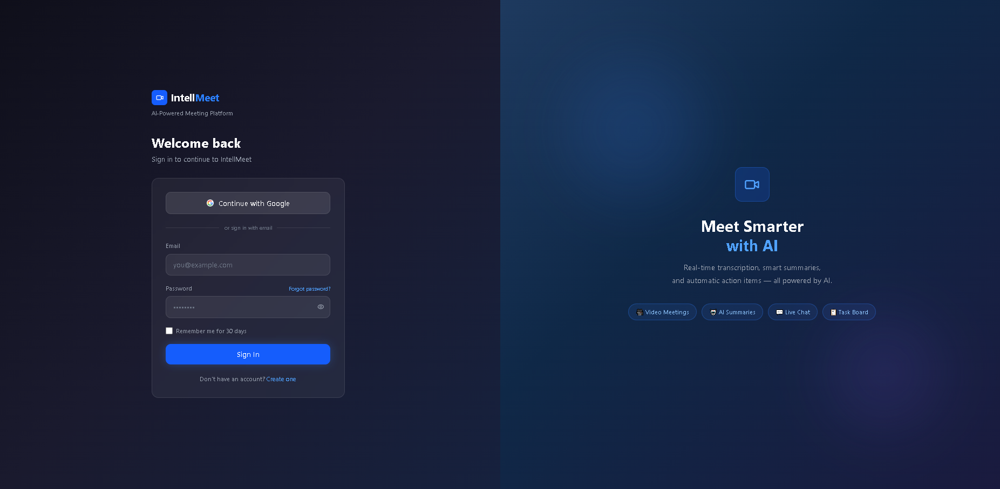
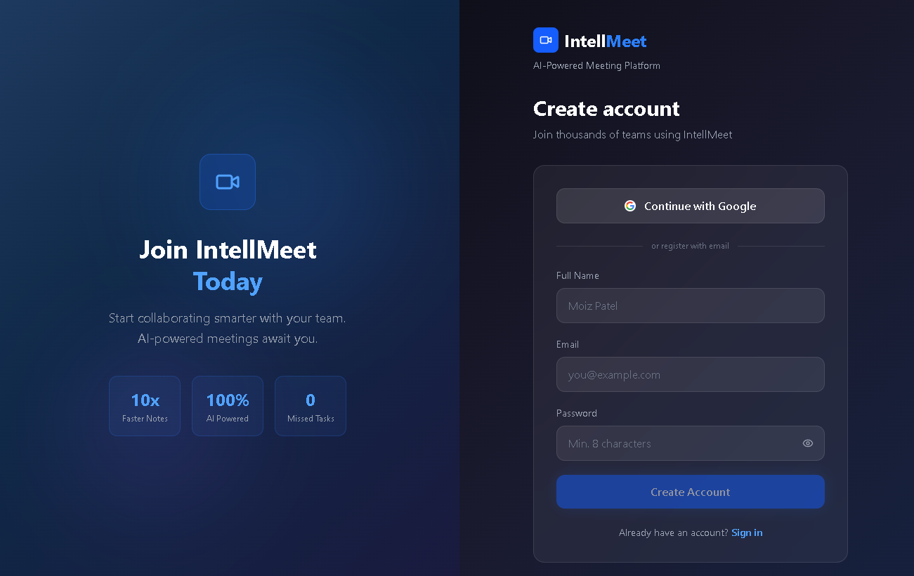
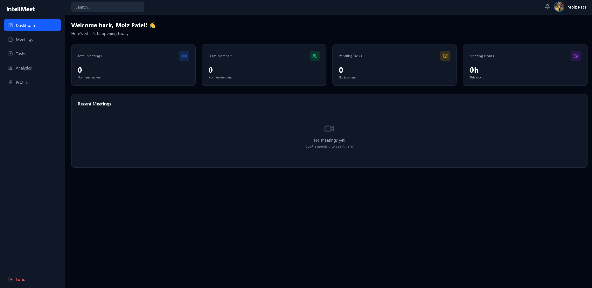
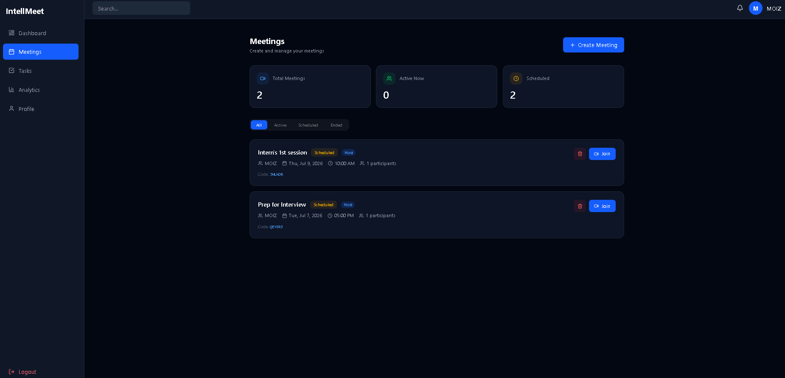
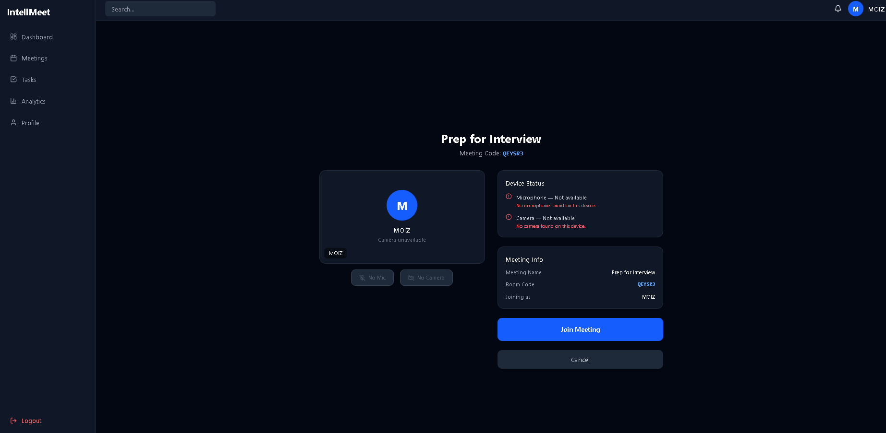
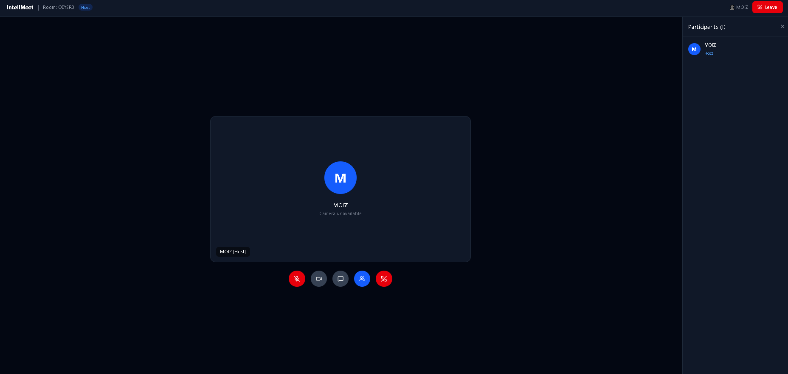
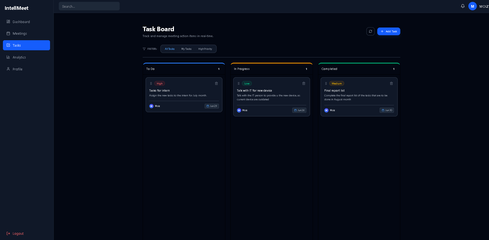
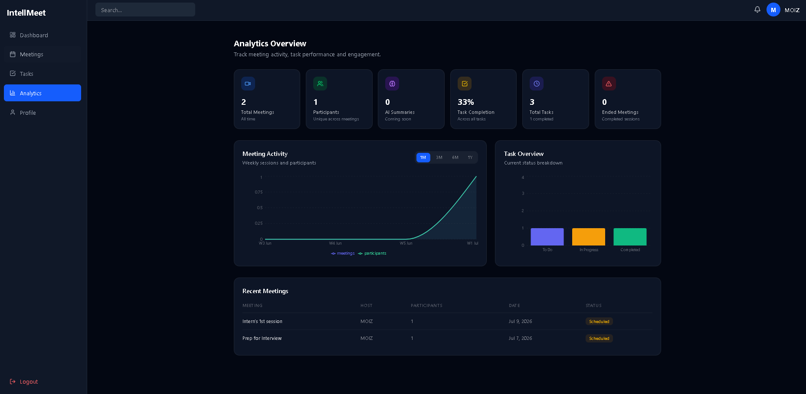
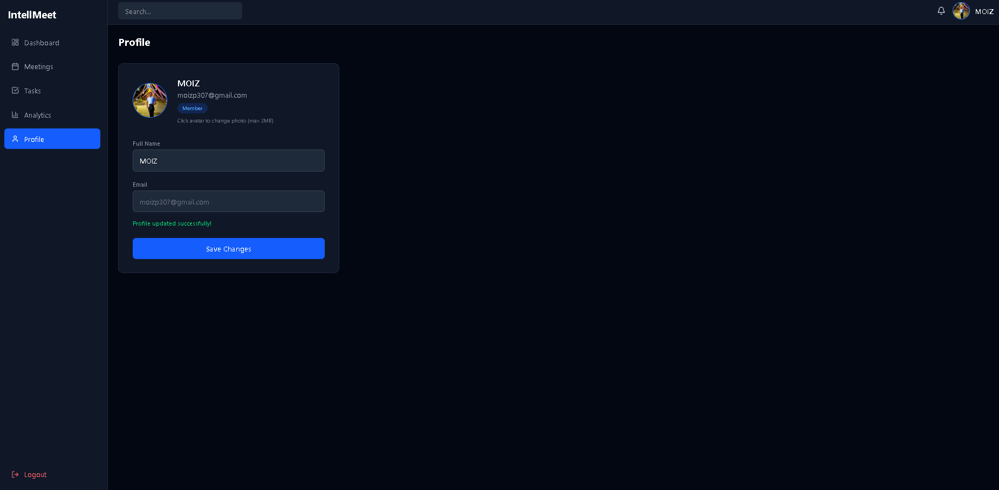

# IntellMeet 🎯
### AI-Powered Enterprise Meeting & Collaboration Platform

> Built as part of the **Zidio Development Internship 2026** — Web Development (MERN) Domain

IntellMeet is a production-grade meeting and collaboration platform built with the MERN stack. It brings together real-time video conferencing, AI-powered transcription and meeting summaries, team collaboration, Kanban task management, and a productivity analytics dashboard — all in one place.



















---

## 🚀 Live Demo
> Coming soon after deployment

---

## ⚙️ Tech Stack


**Frontend:** React 19 + TypeScript · Vite · Tailwind CSS v4 · Zustand · React Router v6

**Backend:** Node.js + Express · MongoDB + Mongoose · Socket.io · JWT Authentication

**AI:** OpenAI Whisper (Transcription) · GPT-4 (Summaries + Action Items)

**DevOps:** Docker + Docker Compose · GitHub Actions CI/CD · Render (Backend) · Vercel (Frontend)

---

## ✨ Features

- [x] Authentication — JWT + Refresh Tokens + Role Based Access Control
- [x] Protected & Public Routes
- [x] App Shell Layout — Sidebar + Navbar across all pages
- [x] Dashboard — Welcome screen with live stats cards
- [x] Kanban Task Board — Drag & drop, real-time DB, filters (All / My Tasks / High Priority)
- [x] Analytics — Meeting activity charts, task completion by department, recent meetings table
- [x] User Profile — Update name + avatar (with live navbar sync)
- [x] User Roles — admin / host / member / viewer
- [ ] Real-Time Video Meetings (WebRTC) — in progress
- [ ] Screen Sharing & Recording
- [ ] AI Meeting Transcription (Whisper)
- [ ] AI Summaries & Action Item Extraction (GPT-4)
- [ ] Real-Time Chat (Socket.io)
- [ ] Fully Responsive UI

---

## 👥 Team

| Name | Role | GitHub |
|------|------|--------|
| Moiz | Team Lead + Auth + Integration + DevOps | [@patel-moiz-371](https://github.com/patel-moiz-371) |
| Jay | Frontend + Dashboard + UI Components | [@gaikwadjay181](https://github.com/gaikwadjay181) |
| Rohit | Meetings + Chat + Socket.io | [@DhoriRohit1](https://github.com/DhoriRohit1) |
| Charulatha | Kanban + Task Management | [@Charulatha2324](https://github.com/Charulatha2324) |

---

## 📁 Branch Strategy

| Branch | Purpose |
|--------|---------|
| `main` | Production ready — final release only |
| `develop` | Active development — all work happens here |

> ⚠️ All active development is on the `develop` branch. `main` will only be updated upon final release.

---

## 🗂️ Project Structure

```
intellmeet/
├── client/                  # React 19 + Vite frontend
│   └── src/
│       ├── components/      # Reusable UI components
│       │   ├── layout/      # AppShell, Navbar, Sidebar
│       │   ├── analytics/   # StatsCard, MeetingChart
│       │   └── kanban/      # Board, Column, TaskCard, AddTaskModal
│       ├── pages/           # Route level pages
│       │   ├── auth/        # Login, Register
│       │   ├── dashboard/   # Dashboard
│       │   ├── tasks/       # Kanban Board
│       │   ├── analytics/   # Analytics
│       │   └── profile/     # User Profile
│       ├── store/           # Zustand state (auth)
│       └── router/          # App routing (AppRouter)
├── server/                  # Node.js + Express backend
│   └── src/
│       ├── modules/
│       │   ├── auth/        # Register, Login, Refresh, Logout
│       │   ├── tasks/       # Task CRUD + status update
│       │   └── users/       # Profile get + update
│       ├── middleware/      # Auth, error handler
│       ├── socket/          # Socket.io events
│       └── utils/           # ApiResponse, ApiError, asyncHandler
├── docs/                    # Screenshots & documentation
└── .github/                 # CI/CD workflows
```

---

## 🛠️ Local Setup

### Prerequisites
- Node.js v20+
- Git
- MongoDB Atlas account (free)

### 1. Clone the Repository
```bash
git clone https://github.com/patel-moiz-371/intellmeet-intership-project.git
cd intellmeet-intership-project
git checkout develop
```

### 2. Setup the Server
```bash
cd server
npm install
```

Create a `.env` file inside the `server/` folder:
```env
PORT=5000
NODE_ENV=development
CLIENT_URL=http://localhost:3000
MONGO_URI=your_mongodb_atlas_uri
JWT_SECRET=your_jwt_secret
JWT_REFRESH_SECRET=your_refresh_secret
JWT_EXPIRES_IN=7d
JWT_REFRESH_EXPIRES_IN=7d
```

Run the server:
```bash
npm run dev
```

### 3. Setup the Client
```bash
cd client
npm install
npm run dev
```

### 4. Open in Browser
```
Frontend: http://localhost:3000
Backend:  http://localhost:5000/health
```

---

## 🔐 API Endpoints

### Auth
| Method | Endpoint | Description |
|--------|----------|-------------|
| POST | `/api/auth/register` | Register new user |
| POST | `/api/auth/login` | Login user |
| POST | `/api/auth/refresh` | Refresh access token |
| POST | `/api/auth/logout` | Logout user |

### Users
| Method | Endpoint | Description |
|--------|----------|-------------|
| GET | `/api/users/me` | Get current user profile |
| PATCH | `/api/users/me` | Update name + avatar |

### Tasks
| Method | Endpoint | Description |
|--------|----------|-------------|
| GET | `/api/tasks` | Get all tasks |
| POST | `/api/tasks` | Create new task |
| PATCH | `/api/tasks/:taskId/status` | Update task status |
| DELETE | `/api/tasks/:taskId` | Delete task |
| GET | `/api/tasks/meeting/:meetingId` | Get tasks by meeting |

---

## 🤝 Team Workflow

```bash
# Start your work session
git checkout develop
git pull origin develop

# Create your feature branch
git checkout -b feature/your-feature-name

# After completing work
git add .
git commit -m "feat: describe your change"
git push origin feature/your-feature-name

# Then open a Pull Request into develop
```

---

*© 2026 IntellMeet — Zidio Development Internship Project*
